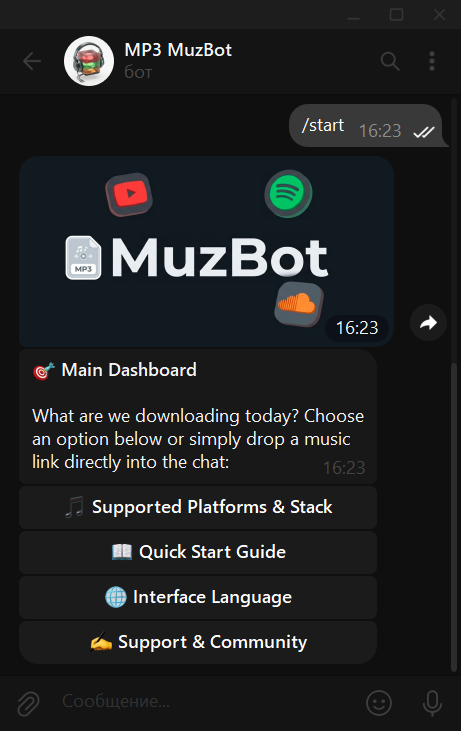
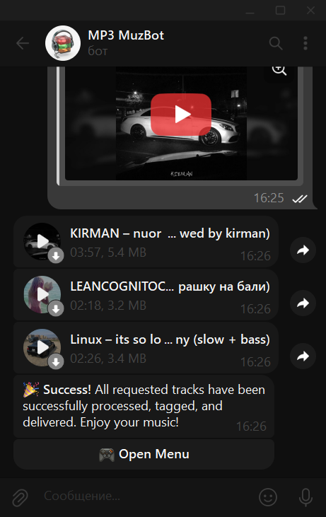

# 🎼 MuzBot & SSY downloader core
> ⚡ **Blazing-fast** Telegram media downloader powered by a clean, independent Python backend core.


An open-source, production-ready Telegram bot for high-speed audio downloading from YouTube Music, SoundCloud, and Spotify. Powered by an optimized, standalone backend core (`ssyd.py`) that handles parsing, streaming, conversion, and metadata tagging seamlessly.

Live Demo: [@gpMP3muz_bot](https://t.me/gpMP3muz_bot) *[OFFLINE]*


## 🐛 Bug Reporting & Feedback

If you encounter any issues, bugs, or limitations while running the bot, feel free to open an **Issue** directly in this repository or contact me via email:

📩 **Email:** `nzr.dev@proton.me`

---

## 📸 Interface Preview

| Main Menu | Download Confirmation | Metadata & Cover Art inside Telegram |
|:---:|:---:|:---:|
|  | `| ` |

---

## 🚀 Bot Features

**Advanced FSM Localization**:

The bot features a fully functional, context-aware language switching system (**English 🇬🇧 / Українська 🇺🇦 / Spanish 🇪🇸**) that persists across user sessions using `aiogram`'s Finite State Machine (FSM).

* **Simple Language Selection:** Users can easily change the interface language at any time via a dedicated menu button.
* **Effortless Scalability:** Adding a new language is incredibly easy. You just need to update a single localization file JSON with the new translations.
* **Quick Setup:** Expanding the language list requires only adding a new selection button to the layout. The system automatically processes the rest.
---

**Smart Bulk Processing:** Detects multiple links or playlists, prompting a confirmation menu before processing downloads. Future updates will introduce rate limiting and stability enhancements to ensure smooth performance under high concurrent user loads.

---
**Telegram Cover Art Fix**: Extracts injected ID3 APIC artwork on-the-fly and serves it directly as a `.jpg` thumbnail during transmission, guaranteeing that cover art renders correctly on all mobile and desktop TG clients.

---

## 🏗️ Core Architecture & API Reference (`ssyd.py`)

The project is built on a decoupled architecture. The file `core/ssyd.py` acts as an independent module. You can easily import it into your own CLI apps, bots, or web scrapers.

### System Flow
The chart below demonstrates how a media link flows from the Telegram user through the `aiogram` handlers, gets parsed, down-sampled via `yt_dlp` + `FFmpeg`, injected with metadata via `mutagen`, and returned back to the chat:

```mermaid
graph TD
    A[User sends Link] --> B[handlers/download.py]
    B --> C{URLParser.link_preparer}
    
    C -->|Invalid Link| D[Return Error Message]
    C -->|Valid Queue| E[FSM Bulk Confirmation Menu]
    
    E -->|Cancel| F[Drop Request]
    E -->|Confirm| G[asyncio.to_thread]
    
    G --> H[core/ssyd.py: GPDownloader]
    H --> I[yt_dlp: Stream Extraction]
    I --> J[FFmpeg: Audio Conversion to MP3]
    J --> K[Mutagen & Pillow: ID3 Tagging & Cover Art Fix]
    
    K --> L[Output Local MP3]
    L --> B
    B --> M[Upload Audio to Telegram]
    M --> N[User receives fully-tagged Track]

    style H fill:#1f1f2e,stroke:#79c0ff,stroke-width:2px
    style C fill:#2e1f1f,stroke:#ff7b72,stroke-width:1px
    style M fill:#1f2e1f,stroke:#56d364,stroke-width:1px
```


---

### `URLParser` Class
Handles link validation, extraction, and platform sorting.
```python
from core.ssyd import URLParser

parser = URLParser()
result, total_count = parser.link_preparer("Check this out: [https://soundcloud.com/track-link](https://soundcloud.com/track-link)")
# result -> dict: { url: (platform, mediatype) }
# total_count -> int: total number of tracks found

```
### `GPDownloader` Class
Manages media streaming via `yt_dlp`, asynchronous conversion using local `FFmpeg` binaries, and ID3 injection via `mutagen`.

```python
from core.ssyd import GPDownloader
import asyncio

downloader = GPDownloader()

# Processes the queue, converts to MP3, embeds metadata, and returns paths to local files
output_files = await asyncio.to_thread(downloader.process, url, platform, mediatype)
# output_files -> list: ['output/track_name.mp3']
```

---

## 📂 File structure
```
├── 📁 core/
│   ├── __init__.py      # Package initializer
│   └── ssyd.py          # Standalone Downloader & Tagging Core
├── 📁 handlers/
│   ├── __init__.py     
│   ├── lang_models.json # Clean JSON localization schema    
│   ├── start.py         # Commands, main menu, and language configuration
│   └── download.py      # Downloader middleware, confirmation logic, and file uploader
├── 📁 bin/              # Local external binaries (Git ignored, required for deployment)
│   ├── ffmpeg           # Audio processing engine
│   └── deno             # JavaScript runtime used to bypass platform scrapers limits
├── .env                 # Environment variables (Bot API token, sensitive admin IDs)
├── config.py            # Global configuration wrapper (reads .env, manages/updates settings.json)
├── settings.json        # Dynamic operational constraints (download limits, module toggles, tech-maintenance stats)
├── bot.py               # Bot entry point
└── requirements.txt     # Python dependencies
```
---

## ⚙️ Installation & Deployment
### 1. Environment Setup
Clone the repository and install the dependencies inside your virtual environment:
``` bash
git clone https://github.com/nzr-xdev/gp_downloader.git
cd gp_downloader
pip install -r requirements.txt
```
### 2. External Binaries Configuration
To manage high-speed conversion and bypass platform restrictions, local binaries are required:

* Navigate to the **Releases** section of this repository.

* Download `bin.zip`.

* Extract the contents directly into the root folder of the project (ensure the path is `bin/ffmpeg` and `bin/deno`).

### 3. Configuration & Startup
Create a `.env` file in the root directory:

```
BOT_TOKEN=your_telegram_bot_token_here
```
Configure global boundaries (e.g., maximum songs per request) inside settings.json and spin up the bot:

``` bash
python bot.py
```
---
### 📄 License

This project is licensed under the **MIT License**. You are free to use, modify, and distribute it, even for commercial purposes, as long as the original copyright and license notice are included.

For more details, see the [LICENSE](LICENSE) file inside this repository or read the full [MIT License text](https://opensource.org/licenses/MIT).